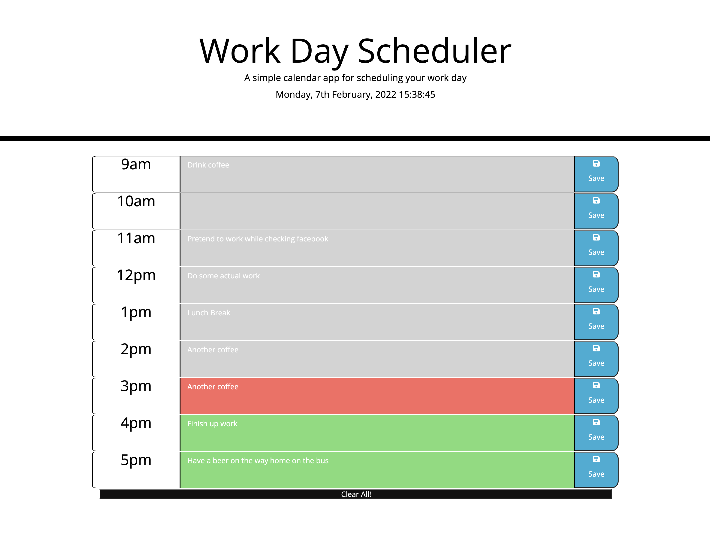

# Work-Day-Planner

## Description

A daily planner to organise my day that saves to local storage and changes colour depending on the current time.

## GitHub Pages Link

Repository - https://github.com/Mattrix01/Work-Day-Planner/tree/dev

Deployment link: https://mattrix01.github.io/Work-Day-Planner/

## Technologies Used

- HTML
- CSS
- Javascript
- Web API's
- Local Storage
- Dynamic HTML
- Timer
- moment
- jQUery
- Bootstrap

## Application Flow

- Current date and time displayed on top of page

- Time blocks change colour depending on the hour we are currently on. (Past, present, future etc)

- When you type into a days input block and click save:

  - Saves to local storage
  - Renders that saved input when document refreshed

## Steps taken

- I linked up all my pages

- I wrote some pseudo code in javascript to make a plan

- I created my timeblocks in HTML

- I began styling them as well as adding some of my own styling

- I used moment to get the current date and time and displayed on page

- I used that moment data from API to style my timeblocks with the relevant colours using a for loop to iterate round the blocks.

- I set up local storage and click function on save button

- I trouble shooted some problems and focused on the first 2 block id's till i resolved issue

- I then finished up styling and matching up the rest of the timeblocks

- I began to add a clear all local storage button at the bottom as a bonus!

## web page screenshot

